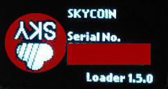

# Frequently Asked Question

## Security

### Random source:

- Does the hardware wallet have an entropy source?
  * Yes, the `True` random number generator peripheral implemented on wallet
    microcontrollers is based on an analog circuit. This circuit generates a 
    continuous analog noise that will be used by the RNG processing in order to 
    produce a 32-bit random number. To verify the true randomness of the numbers 
    generated a verification is performed based on the
    National Institute of Standards and Technology (NIST) Statistical Test Suite (STS) 
    SP 800-22rev1a (April 2010).
- Does the hardware wallet get entropy from the host machine?
  * Yes, an external random 32 bytes  buffer is used to increase internal entropy
    when performing cryptographically sensitive operations e.g. mnemonic generation
- How does the hardware wallet get entropy?
  * The hardware wallet generates internal entropy from a peripheral device. This value is
    [salted with several sources](https://security.stackexchange.com/questions/73588/does-too-long-a-salt-reduce-the-security-of-a-stored-password-hash)
    so as to make unfeasible some kinds of dictionary and lookup attacks (e.g. [rainbow tables](https://en.wikipedia.org/wiki/Rainbow_table) ).
    The salt is chosen in such a way that no two devices can generate the same value in (at least) the time frame of a human lifetime.
    Such values [might not be particularly random](https://security.stackexchange.com/questions/16117/in-hashing-does-it-matter-how-random-a-salt-is).
    Internal entropy is eventually combined with an external entropy received from the user host device.

### Why do I see a inverted skycoin logo in bootloader?

If you see an inverted skycoin logo in bootloader mode like in the following image, maybe you have either flashed for development or not official device.

